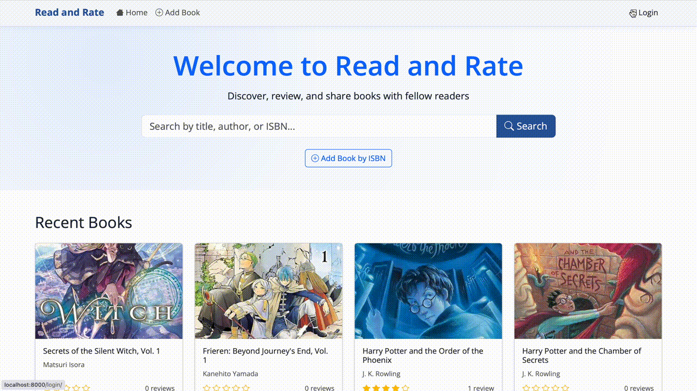
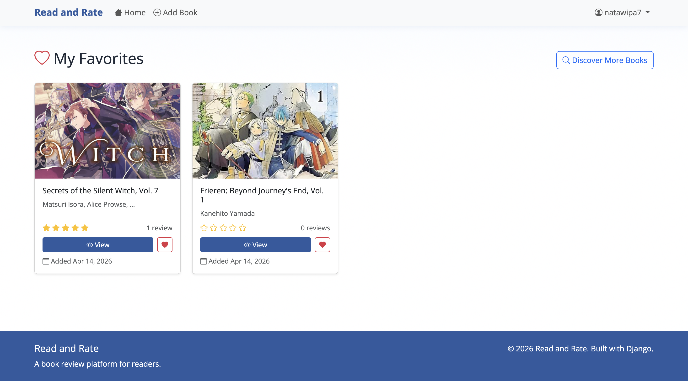
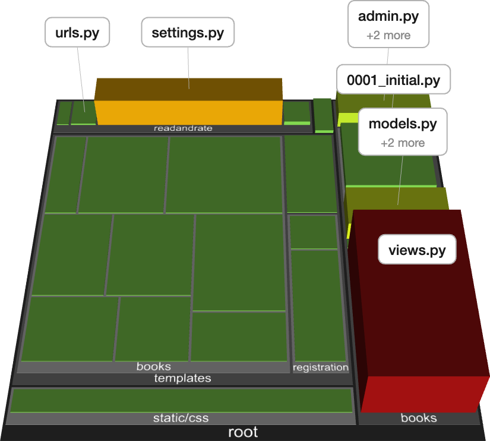

# Read and Rate

Read and Rate is a web application that helps people discover books, share opinions, and make better reading decisions through ratings and reviews. The platform supports searchable book listings, detailed book pages, user favorites, and review moderation.

## Project Description

Read and Rate is designed as a student software engineering project to demonstrate full-stack web development, architecture design, database modeling, authentication, and maintainable code organization. The system integrates external book metadata through Google Books API and supports both authenticated users and moderated community content.

## Problem Statement

Many readers struggle to decide what to read next because book information is scattered across multiple websites. Existing platforms are often overloaded with ads, hard to navigate, or not focused on simple community-driven reviews. This project solves that problem by providing a focused and easy-to-use review platform with search, ratings, and user contributions.

## Target Users

- General readers who want to discover and evaluate books
- Students who need quick access to book details and community reviews
- Book club members who want to share reading feedback
- Administrators who moderate reviews and maintain platform quality

## System Architecture Overview

The system follows a layered MVC-style architecture in Django:

- Presentation layer: Django templates with Bootstrap and custom CSS
- Application layer: Django views and URL routing for business flow
- Domain/data layer: Django models for books, reviews, favorites, and users
- Infrastructure layer: PostgreSQL database, Google Books API, Google OAuth

Request flow:

1. User action in browser triggers a route.
2. View validates input and applies business rules.
3. Data is read/written through ORM models.
4. Template renders result and returns HTML response.

## User Roles and Permissions

### Guest User

- Can browse books and search by title, author, or ISBN
- Can view book details and existing reviews
- Can submit anonymous reviews (with controlled deletion flow)

### Authenticated User (Google OAuth)

- Can sign in with Google
- Can submit reviews linked to personal account
- Can manage favorites
- Can view personal reviews and favorites

### Admin User

- Can access Django admin dashboard
- Can moderate and delete inappropriate reviews
- Can monitor application content quality

## Technology Stack

### Frontend

- Django Templates
- Bootstrap 5
- Bootstrap Icons
- Open Sans (Google Fonts)
- Custom CSS

### Backend

- Python 3.13
- Django 6
- django-allauth (Google OAuth authentication)
- requests (HTTP API integration)

### Database

- PostgreSQL (primary)
- SQLite (fallback in development if DB env vars are absent)

### External APIs and Services

- Google Books API for book metadata lookup by ISBN
- Google OAuth 2.0 for login

## Code Structure and Repository Organization

The project is organized using a layered Django structure:

1. Configuration layer

- `readandrate/settings.py`: environment loading, app registration, middleware, OAuth, and database configuration
- `readandrate/urls.py`: root URL routing
- `readandrate/asgi.py` and `readandrate/wsgi.py`: deployment entry points

2. Application layer

- `books/urls.py`: app-level route mapping
- `books/views.py`: request handling, validation, business flow, API integration, and page rendering control

3. Domain/data layer

- `books/models.py`: core entities (`Book`, `Review`, `Favorite`) and domain helper methods
- `books/migrations/`: schema evolution history

4. Presentation layer

- `templates/`: page templates grouped by feature (`books/`, `registration/`)
- `templates/base.html`: shared layout and navigation
- `static/css/custom.css`: custom styling

5. Administration layer

- `books/admin.py`: admin model registration, moderation views, and list/search/filter configuration

## Database Design

The system uses PostgreSQL as the primary database (with SQLite fallback for local development when DB environment variables are not set).

### Core tables/entities

1. `Book`

- Fields: `id`, `title`, `author`, `description`, `genre`, `isbn`, `thumbnail_url`, `published_date`, `created_at`
- Constraint: `isbn` is unique

2. `Review`

- Fields: `id`, `book_id`, `user_id` (nullable), `nickname`, `password_hash`, `rating`, `review_text`, `created_at`, `updated_at`
- Constraints: `rating` must be between 1 and 5
- Supports both authenticated and anonymous reviews

3. `Favorite`

- Fields: `id`, `user_id`, `book_id`, `created_at`
- Constraint: unique pair (`user_id`, `book_id`) to prevent duplicate favorites

### Relationships

- One `Book` has many `Review` records (1:N)
- One authenticated `User` can create many `Review` records (1:N)
- `User` and `Book` have a many-to-many relation through `Favorite`

### Data access pattern

- Views use Django ORM queries (`filter`, `create`, `get_or_create`, `select_related`) instead of raw SQL
- Business rules (review limits, favorite toggling, anonymous password checks) are enforced in the application layer before persistence

## Installation and Setup

### Prerequisites

- Python 3.11+
- PostgreSQL 14+ (or higher)
- Google Cloud OAuth client for web application

### Steps

1. Clone the repository.
2. Create and activate a virtual environment.
3. Install dependencies:

```bash
pip install -r requirements.txt
```

4. Configure environment variables in `.env`.
5. Ensure PostgreSQL is running and credentials are valid.
6. Run migrations:

```bash
python manage.py migrate
```

7. Start server:

```bash
python manage.py runserver
```

## How to Run the System

- Open `http://localhost:8000/`
- Use `http://localhost:8000/login/` for Google sign-in
- Admin panel: `http://localhost:8000/admin/`

## Example Environment Variables

```env
# Google OAuth
GOOGLE_OAUTH_CLIENT_ID=your_google_client_id
GOOGLE_OAUTH_CLIENT_SECRET=your_google_client_secret
DJANGO_ALLOWED_HOSTS=localhost,127.0.0.1
DJANGO_SITE_ID=1
DJANGO_CANONICAL_HOST=localhost:8000
DJANGO_CANONICAL_SCHEME=http

# Database
DATABASE_NAME=readandrate_db
DATABASE_USER=readandrate_user
DATABASE_PASSWORD=your_secure_password
DATABASE_HOST=127.0.0.1
DATABASE_PORT=5432

# Django
DJANGO_SECRET_KEY=your_secret_key
DJANGO_DEBUG=True
```

## Screenshots and Demo Videos

### Discover Books

Search for books by title, author, or ISBN with fast and intuitive results.


---

### Add Books

Easily add new books using ISBN with automatic data from Google Books API.


---

### Authentication

Sign in securely using Google OAuth for a personalized experience.



---

### Share Your Thoughts

Authenticated users can write and manage their own reviews.


---

### Open Community Reviews

Guests can also contribute reviews with a controlled moderation system.


---

## Extra Features

### Save Your Favorites

Keep track of books you love in your personal favorites list.



---

## System Insight

### Code Structure Visualization

Understand the internal architecture and complexity of the system.


